# Alpha Factor Mining System

[](./LICENSE)
[](https://www.python.org/downloads/)
[](https://github.com/aznikline/alpha-mining-system)
[](./README.md)

> A modular, extensible automated Alpha factor mining platform for A-share and US equity markets, inspired by WorldQuant / BigQuant.

A modular, extensible automated Alpha factor mining platform. Supports three factor generation modes — manual expression, genetic programming, and deep learning — covering the full research workflow: data loading → factor computation → validity evaluation → visualization reports.

**24 operators · 3 factor generation modes · A-share + US markets · CLI + Streamlit + Notebook**

### 30-second start

```python
from alpha_mining import init_data, quick_evaluate

# One-liner data load (A-share / US auto-routing + normalization + derived features)
data = init_data(market='a_share', start='2019-01-01', end='2024-12-31')

# One-liner factor evaluation: expression -> IC / group backtest / long-short / charts
result = quick_evaluate("rank(ts_mean(close,20)/close)", data, n_groups=5)
```



```mermaid
flowchart LR
    subgraph Data["📊 Data"]
        AK[Akshare A-share]
        TS[Tushare]
        BS[Baostock]
        YF[YFinance US]
    end
    subgraph Engine["🔧 Factor Engine"]
        EX["Expression<br/>(WorldQuant syntax)"]
        GP["Genetic Programming<br/>(gplearn)"]
        DA["DeepAlpha<br/>(DNN/LSTM)"]
    end
    subgraph Eval["📈 Evaluation"]
        IC[IC/IC_IR]
        BG[Group backtest]
        LS[Long-short perf]
    end
    subgraph Viz["🎨 Visualization"]
        P1[IC series]
        P2[Net value curve]
        P3[Group returns]
        P4[Monthly heatmap]
    end
    Data --> Engine --> Eval --> Viz
    style Engine fill:#1a1f2e,color:#7dd3fc
    style Data fill:#14171d,color:#e6e9ef
    style Eval fill:#14171d,color:#e6e9ef
    style Viz fill:#14171d,color:#e6e9ef
```

## Core Features

### 📊 Data Layer
- **Multi-source data**: Akshare (free A-share), Tushare (pro data), Baostock (stable), YFinance (US equities)
- **Auto-fallback**: tries backup sources when the preferred one fails
- **Multi-market**: A-share (`a_share`) and US (`us`) routing
- **Parquet cache**: no re-download for repeated use
- **Normalization**: unified field naming, format, and adjustment handling

### 🔧 Factor Engine
- **Three generation modes**
  - Manual expression: WorldQuant-style expression syntax
  - Genetic programming: gplearn auto-evolves effective factors
  - DeepAlpha: DNN/LSTM deep-learning implicit factors

- **24 built-in operators**
  - Cross-sectional: `rank`, `zscore`, `demean`, `scale`
  - Time-series: `ts_mean`, `ts_std`, `ts_delta`, `ts_corr`, `ts_skew`, `ts_kurt`, `residual`
  - Math: `abs`, `sign`, `log`, `power`, `sqrt`, `add`, `sub`, `mul`, `div`
  - Conditional: `if_else`

### 📈 Factor Evaluation
- **IC analysis**: Pearson / Spearman
- **IC_IR stability**: IC mean / std
- **5-10 group backtest**: tiered annualized return comparison
- **Long-short performance**: annualized return, Sharpe, max drawdown, Calmar
- **Turnover analysis**: factor stability
- **Strict train/test split**: avoids overfitting
- **Industry/size neutralization**: optional

### 🎨 Visualization
- IC time series (±2σ channel)
- Long-short net value curve
- Group cumulative return comparison
- Monthly IC heatmap
- Factor overview summary

---

## Quick Start

### Install

```bash
pip install -r requirements.txt
```

Optional modes as needed:

```bash
pip install gplearn      # genetic programming
pip install torch         # DeepAlpha deep learning
pip install streamlit     # web UI
```

### CLI (v3.0 standard package entry)

```bash
# System info and available modes
python -m alpha_mining info

# Run with default config.yaml
python -m alpha_mining run

# Pass factor expressions directly (overrides config)
python -m alpha_mining run -e "rank(ts_mean(close,20)/close)" "-rank(ts_std(return_1d,20))"

# Specify market / generation mode
python -m alpha_mining run --market us --mode expression

# Skip plot generation
python -m alpha_mining run --no-plots

# Specify a config file
python -m alpha_mining run -c my_config.yaml
```

### Streamlit Web UI

```bash
streamlit run app.py
```

### Notebook-first workflow

The v3.0 high-level API is designed for notebooks — one-liners for load / evaluate:

```python
from alpha_mining import init_data, quick_evaluate, compare_factors

# One-liner data load (with normalization + derived features)
data = init_data(market='a_share', start='2019-01-01', end='2024-12-31')

# One-liner single-factor evaluation
result = quick_evaluate("rank(ts_mean(close,20)/close)", data, n_groups=5)

# Compare multiple factors
compare_factors(["rank(ts_delta(close,5))", "-rank(ts_std(return_1d,20))"], data)
```

Full example in [`notebooks/01_quickstart.ipynb`](notebooks/01_quickstart.ipynb).

### Config

Full config in [`config.yaml`](config.yaml), main sections:

```yaml
market: a_share            # a_share / us

data:
  preferred_source: null   # null = auto by market; or akshare/tushare/baostock/yfinance
  fallback_sources: [tushare, baostock]
  start_date: "2019-01-01"
  end_date: "2024-12-31"
  symbols: all             # all = full market; or ["000001.SZ", "000002.SZ"]

factor_generation:
  mode: expression          # expression / gplearn / deep_alpha
  expressions:             # mode 1
    - "rank(ts_mean(close,20)/close)"
    - "-rank(ts_std(return_1d,20))"
  gp:                       # mode 2
    population_size: 200
    generations: 20
    top_n: 5
  deep_alpha:               # mode 3
    model_type: dnn         # dnn / lstm / transformer
    hidden_layers: [128, 64, 32]
    num_output_factors: 10

evaluation:
  n_groups: 5
  train_ratio: 0.8
  neutralize: false        # industry/size neutralization

filter:                    # factor screening thresholds
  min_train_icir: 0.5
  min_test_ic_mean: 0.02
  min_ls_sharpe_train: 1.0
```

---

## Factor Expression Reference

| Expression | Meaning | Expected IC direction |
|--------|----------|------------|
| `rank(ts_mean(close,20)/close)` | Price deviation from MA | Negative |
| `ts_delta(close,5)` | 5-day momentum | Pos/Neg |
| `-rank(ts_std(return_1d,20))` | Volatility reversal | Positive |
| `ts_zscore(volume,10)*-1` | Volume anomaly | Positive |
| `rank(close_vwap_diff)` | Price vs VWAP gap | Negative |
| `ts_skew(return_1d,20)` | Return skewness | Negative |
| `residual(close, log_volume, 20)` | Residual return after volume explanation | Positive |

---

## Project Structure

```
alpha-mining-system/
├── alpha_mining/                # v3.0 standard package
│   ├── __init__.py             # package entry, exports high-level API
│   ├── __main__.py             # python -m alpha_mining entry
│   ├── cli.py                  # CLI (run / info)
│   ├── api.py                  # notebook high-level API
│   ├── data_hub.py             # unified data abstraction (multi-market)
│   ├── factor_engine.py        # factor computation engine
│   ├── evaluator.py            # factor evaluator (neutralization)
│   ├── visualizer.py           # result visualization
│   ├── operators.py            # 24 operators
│   ├── utils.py                # utilities
│   └── data_adapters/          # data source adapters (market-aware)
│       ├── base_adapter.py
│       ├── akshare_adapter.py
│       ├── tushare_adapter.py
│       ├── baostock_adapter.py
│       └── yfinance_adapter.py
├── notebooks/
│   └── 01_quickstart.ipynb     # notebook-first workflow example
├── api/
│   └── index.py                # Vercel Serverless Function entry
├── app.py                      # Streamlit web UI
├── config.yaml                 # default config
├── requirements.txt
├── vercel.json
├── LICENSE
└── README.md
```

Runtime-generated: `data_cache/`, `factor_cache/`, `results/` — all in `.gitignore`.

---

## v3.0 Highlights

Changes vs v2.1:

1. **Standard Python package** — from top-level script to `alpha_mining/` package, entry unified as `python -m alpha_mining`.
2. **Notebook-first workflow** — new high-level API (`init_data` / `quick_evaluate` / `compare_factors`), one-liner load and evaluate.
3. **CLI** — `run` / `info` subcommands, with `-e` expressions, `--market` / `--mode` overrides, for batch and automated backtests.
4. **Streamlit web UI** — `streamlit run app.py` for interactive factor exploration.
5. **Serverless API** — `api/index.py` lightweight HTTP interface.
6. **Factor metadata** — `FactorResult` wrapper carries `name` / `category` / `source` / `expression` / `data_version` / `generated_at` for full provenance.
7. **Higher-order operators** — `ts_skew` / `ts_kurt` / `residual`.
8. **Multi-market** — `market` param routes A-share / US; adapters auto-filter by market.

---

## Effective Factor Screening Criteria

| Metric | Min threshold | Excellent |
|------|----------|----------|
| Train RankIC_IR | > 0.3 | > 0.5 |
| Test RankIC mean | > 0.01 | > 0.03 |
| Long-short Sharpe (train) | > 0.5 | > 1.0 |
| Direction consistency | train/test same sign | - |
| Daily turnover | < 0.3 | < 0.15 |

---

## Deployment & Integration

- GitHub: https://github.com/aznikline/alpha-mining-system
- Vercel Serverless: API mode (see `vercel.json` / `api/index.py`)
- Local Docker: `docker run -v $(pwd)/config.yaml:/app/config.yaml ...`

---

## Related

This repo is part of a quant series:

- **[`alpha`](https://github.com/aznikline/alpha)** — OpenAlpha factor discovery → qmt execution bridge. alpha-mining-system **mines** factors (GP / DeepAlpha); alpha **bridges** them to the execution framework (`SignalAlphaFactor` adapter, 116 tests + Protocol fallback for standalone use).
- **qmt / ptrade** — the author's private execution frameworks (private to isolate trading logic); the bridge targets qmt's `AlphaFactor` interface.

---

## License

[MIT License](./LICENSE) © 2026 aznikline
